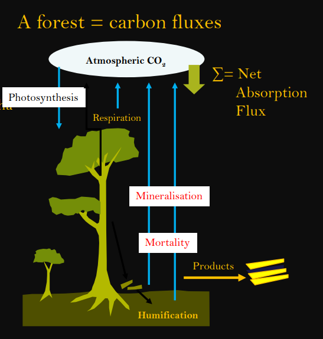
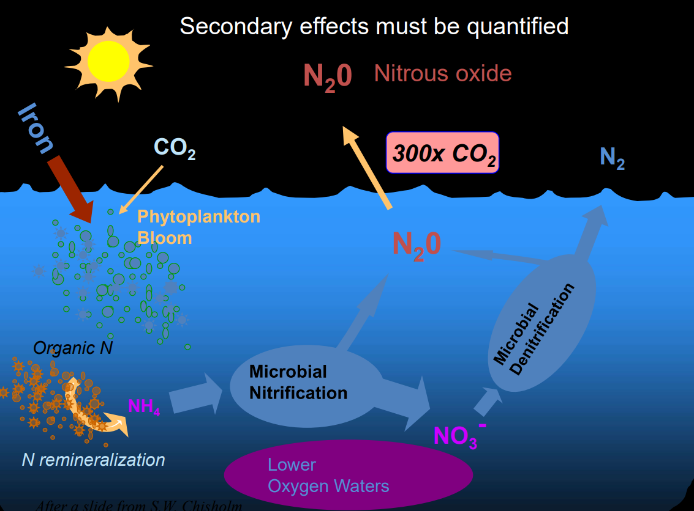
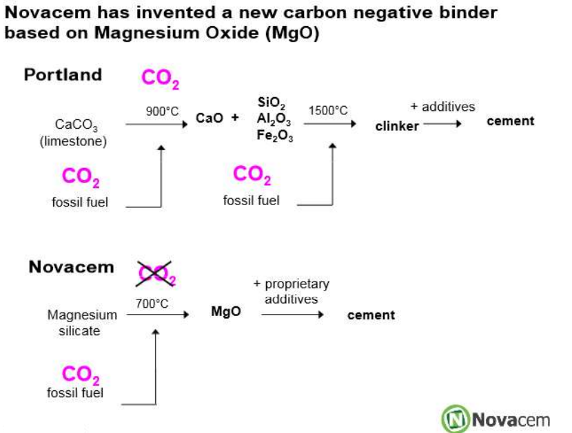

# Lec 8: Global catastrophic risks & Unexpected Climate Changes

## Tipping point

- A tipping point in the climate system is a threshold that, when exceeded, can lead to large changes in the state of the system such as mass extinction of species, dramatic sea level rise, extensive droughts and the transformation of forests into vast grasslands

## Some climate events scientists are worried about

- **The Arctic sea ice melts**
  - Scientists think passed tipping point
  - ice melts, dark ocean water is exposed that absorbs more sunlight, more warming
-  **Greenland becomes ice-free**
  -  expected to raise sea levels by up to 20 feet
  - NYC new Atlantis
- **West Antarctic ice sheet disintegrates**
  - entire collapse of the glacier, which would raise sea level by 16 feet
- **El Niño becomes a more permanent climate fixture**
  - The oceans absorb about 90 % of the extra heat that is being trapped in the Earth system by greenhouse gases. This could affect the ocean dynamics that control El Niño events. That would cause extensive drought conditions in Southeast Asia
- **Amazon rainforest dies back**
  - Typical no tree- no-rain shenanigans, loss of biodiversity
  - reduction of the Amazon ultimately depends on what happens with El Niño, along with future land-use changes from human activities.
- **Boreal forests are cut in half**
  - Canada, Russia and other parts of the uppermost Northern Hemisphere.
  - Forest -> open woodlands or grasslands, carbon balance disrupted.

## Black Swan Theory

- Describe the impact of events that come as a surprise in societal aspects
- Three properties:
  - Rarity: surprise event
  - Extreme impact
  - Retrospective predictability 

- eg: internet, WW1 ...

- **Gray Goo** : Bullshit conspiracy theory vibe, nano robots eat us and self replicate to consume earth
- **Doomsday clock** (where is this even going): Clock represents the hypothetical global catastrophe as "midnight" and the Bulletin's opinion on how close the world is to a global catastrophe as a number of "minutes" to midnight

## GTS

- Global terrestrial stilling
- decrease of wind speed near the surface
- weakening of winds over continental surfaces, strengthen over ocean regions
- affect windo power gen, agriculture ig etc

- **Hypercane**
  - extreme tropical cyclone that could form if ocean temperatures reached approximately 50 °C (global warming ofc evs)
  - extend into the upper stratosphere (normal reaches only lower stratosphere)
  - Damage ozone layer

## Unexpected climate changes

- Volcano boom boom more frequent (somehoe caused by changing weight distribution of earth cuz global warming, obv)
- Dark oceans (more rain in some areas, rivers carry more black stuff, bad, changes ecosystem)
- Sunlight will reach the seabed at the North Pole
- Ant invasion slows down (what even)
  - big-headed ants are one of the most dangerous invasive species on Earth
  - ants prey even on chicks of small birds
  - Earth temp inc => cold blooded ants dont spread so fast
- Decline of desert bacteria (Ast he temperature due to climate change has become more volatile, the desert bacteria have to adapt to it, and desert soil will become more susceptible to erosion as a result of their decline)
- No beaches
- Faster tree growth (higher levels of carbon dioxide and nitrogen in the atmosphere may contribute to tree growth.)
- More lightning (global warming=> more water vapour)
- Deteriorating Mummies (chomp bacteria apparently grows)
- fightFight (precipitation=> ppl lose their shit and start _tatakae_)

## Cartaret island

- Papua New Guinea, first ever climate change refugees cuz of rising sea level
- Non existent carbon footprint 
- years of salt waterinundated their crops and infiltrated the fresh water wells.

# Lec 9: Carbon Sequestration

Carbon sequestration is the process of storing carbon in a carbon pool. 

- US: Carbon negative from pov of C-sequestration due to land use change (but highest emission of C too)
- Carbon sources (Fossil fuels, respiration, decomposition), sinks(photosynthesis, absorbed by oceans)
- About 30 per cent of the anthropogenic (caused by human activity) CO₂emissions have been taken up by the ocean and about 30 per cent by land. The remaining 40% of emissions have led to an increase in the concentration of CO₂ in the atmosphere.

## Forest

Forest as carbon stocks

- 1kg dry wood = 0.5kg carbon

Forest as carbon flux

- Worlds forest contain about 1 trillion tonnes of C
- Deforestation of about 11 mil ha/year, accounting to release of about 3.6-4.5 billion tonnes of C, 17% of total C emission
- changing management,increasing forest area, or shifting species, could also help reduce net emissions of green house gases
- Old-growth forests store more C

## Sequestration

The process through which CO2 from the atmosphere is absorbed naturally through photosynthesis & stored as carbon in biomass &soils.

- Technique for long term storage of CO2
- Ways of sequestration
  - Plants and soil (terrestrial sequestration)
  - Underground (geological seq.)
  - Ocean (ocean seq.)

## increase C seq. above baseline

- Increase sequestration
  - Afforestation
  - Reduce cultivation
  - increase agroforestry (reforestation-deforestation)
  - reduce conversion of forest land to cultvation
  - improve forest management
- Reduce emission
  - Wildfire management
- Inc seq and red emission
  - Substitute renewable biomass for fossil fuel energy
  - Efficient use of raw mat
  - paper and wood recycling
  - plant trees in urban and suburban areas

- Benefits of agroforestry:
  - sequesters carbon in vegetation and soil depending on the preconversion vegetation and soil carbon
  - wood products produced serve as substitute for similar products unsustainably harvested from natural forests
  - increases income to farmers
- Types of agroforestry (?)
  - Windbreaks: store C+ protect farmlstead, livestock, soil and crop
  - Riparian forest buffer: store C+ protect water quality
  - Silvopasture: Store C+ give food to livestock if trees+grass are properly maintained
  - Short rotation woody crops: store C+ wood income

The productivity of any forest depends on the age of its vegetation. Forest plantations sequester carbon till maturity which would vary from 25 to 75 years depending upon the type of forests. At later stages, there is only marginal carbon sequestration.

new plantations on degraded and waste lands are the best options for carbon storage when these are planted/harvested periodically and used as a long term source of timber

## International examples of C seq. projects in the forestry sector

- infapro, Malaysia
  - FACE Foundation, Innoprise cosropation
  - Activities: rainforest rehabilitation with enrichment planting using35 indigenous tree species
  - Duration : plantation over 25 years with 60 year growth cycle
- Plan Vivo, Mexico
  - FIA, Formula One Foundation; Ambio, cooperative of Foresters; local community groups and small farmers associations
  - Activities: plantations, agroforestry, communal reforestation
  - sequester carbon with sustainable forestry 
  - To Generate benefits for local livelihoods

# Lec 10: Ocean sequestration

- Bio C seq: 
  - Azolla, Peat production, Reforestation.
  - Agriculture
    - Reduce emission (Accurate use of fertilizers, Less soil disturbances better irrigation, Replacing more energy intensive farming operations, Incorporate post harvest residues)
    - Enhancing carbon removal (use cover crops, grass, weed, concentrate livestock on small paddocks for days, Cover bare paddocks with hay or dead vegetation, restore degraded land)
- Geological Seq
  - Storing of CO2 underground in rock formations able to retain large amounts of CO2 over a long time period
  - Midwest Geological Sequestration Consortium
- Ocean Seq
  - Two pumps: Solubility and biological
  - 2 analogous manmade methods: direct injection and ocean fertilization
  - (80% of the carbon will remain in the ocean with or without human intervention, eventually) This is done only to speed up the natural process
  - Ocean has 50 times more carbon than the atmosphere

## Iron hypothesis

- Antartic waters are plant nutrient rich (P,N,Si), but have low plankton cuz of Fe deficiency.
- More Fe-> more plankton => more seq

## Urea fertilization

- Dump urea in ocean to stimulate phytoplankton growth

- Problem: also increases growth of cyanobacteria, diatoms and flagellates, which release toxins (paraletyc shellfish poisoning and amnesiaic shellfish poisoning in local waters) and CO2 after death (how the turntables)

- Intended consequences of large scale fertilization: 

  - Inc. deep ocean conc. of CO2 and N and P
  - Dec deep ocean conc. of O2
  - Dec surface layer conc of N,P and Si

  

- In the end, large scale ocean fert. results in Fundamental alterations of marine ecosystems and bio-geochemical cycles
  - Cant be quantified with acceptable accuracy
  - negative outcomes can't be remediated

## Ocean Acidification

- Ocean absorb CO2=> becomes more acidic, causing global ocean chemistry to change more quicklythan ocean systems can handle
- Issues:
  - Affects respiration, photosynthesis
  - Shells dissolve
  - Affects behaviour non-calcfying organisms, like cownfish larva (nemo)

## CO2 storage in coal beds

- Coal pores have methane adsorbed
- CO2 has more affinity to these pores, and methane can be displaced by CO2, said methane being used as fuel
- Panik: Methane 72x worse in heating up the atmosphere than CO2, so even minute leaks in the transfer pipe => ded
- Injection of CO2 and capture of released CH4 would require an dense grid of pipes on the ground over the coal beds that are being used

- Novacem: new kind of cement, carbon negative

Use novacem instead of Portland cem=> 5% manmade CO2 emission is converted to 5% CO2 absorption
